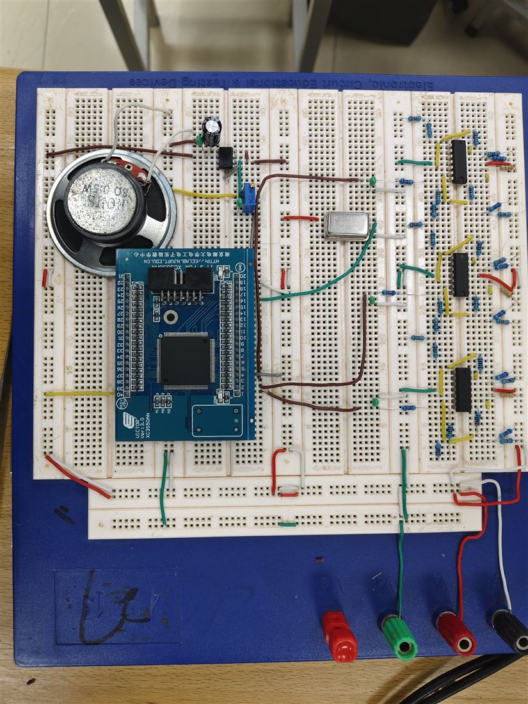
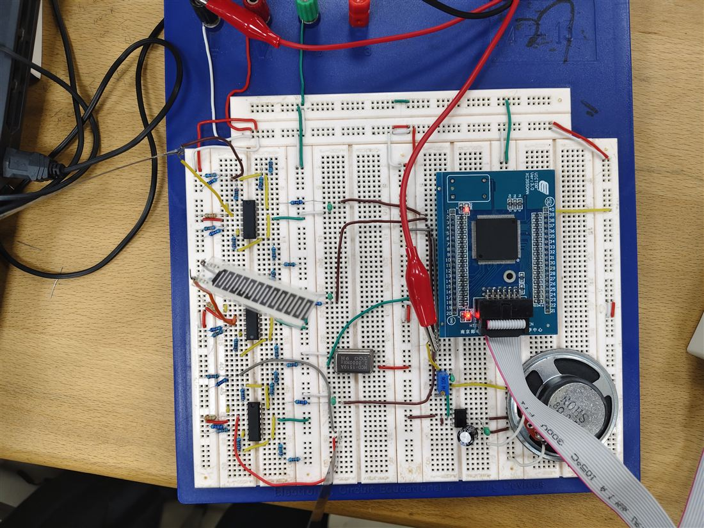

# FPGA 手指钢琴

基于三路 FSR 压力传感器、TL084 信号调理、Xilinx Spartan-3AN FPGA 与 LM386 功放实现的课程设计作品。

## 已完成内容

- 三路 FSR 传感器采样与 0 / 3.3 V 逻辑转换
- FPGA 对 3 位输入状态进行音符译码
- 基于 2 MHz 时钟分频产生 C4～B4 方波音频
- P90 输出经电位器、LM386 和扬声器发声
- 完成基本指标调测；未进行扩展指标

## 系统结构

```
FSR × 3 → TL084 信号调理 × 3 → FPGA (P76/P77/P78)
                                      │
                                      └→ P90 → 音量电位器 → LM386 → 扬声器
```

## 引脚约定

| 信号 | FPGA 管脚 | 说明 |
|---|---:|---|
| `clk_2m` | P124 | 2 MHz 时钟输入 |
| `A` | P76 | 传感器通道 1 |
| `B` | P77 | 传感器通道 2 |
| `C` | P78 | 传感器通道 3 |
| `audio_out` | P90 | 音频方波输出 |

传感器通道为低电平有效：三路都不按下时 `A B C = 111`，系统静音。

## 音符映射

| ABC | 音符 | 理论频率 |
|---:|---|---:|
| 110 | C4 | 261.62 Hz |
| 101 | D4 | 293.67 Hz |
| 100 | E4 | 329.63 Hz |
| 011 | F4 | 349.23 Hz |
| 010 | G4 | 391.99 Hz |
| 001 | A4 | 440.00 Hz |
| 000 | B4 | 493.88 Hz |
| 111 | 静音 | — |

## 目录说明

- [src/finger_piano.v](src/finger_piano.v)：实际烧录的 Verilog 顶层源码
- [constraints/finger_piano.ucf](constraints/finger_piano.ucf)：XC3S50AN 引脚约束
- [docs/课程设计报告_手抄完整版.md](docs/课程设计报告_手抄完整版.md)：课程设计报告稿
- [docs/验收三基本指标调测单.md](docs/验收三基本指标调测单.md)：验收三调测步骤与记录
- [docs/ISE生成bit与烧录操作单.md](docs/ISE生成bit与烧录操作单.md)：从 ISE 工程到 `.bit`、烧录的操作说明
- [schematics/](schematics)：系统电路图、RTL 图与 LM386 功放图

## 实物与验收照片



图：三路传感器调理电路、FPGA、时钟、LM386 与扬声器的整体搭建实物图。



图：验收三调测时的实际连接状态。

## 使用说明

本工程面向 Xilinx ISE 14.7，目标器件为 `xc3s50an-5tqg144`。新建工程后加入 `src/finger_piano.v` 和 `constraints/finger_piano.ucf`，综合、实现并生成 `.bit` 文件。详细操作见上面的 ISE 文档。

> 硬件接线前应先断电核对，FPGA I/O 只能接入 3.3 V 逻辑电平，所有模块必须共地。

